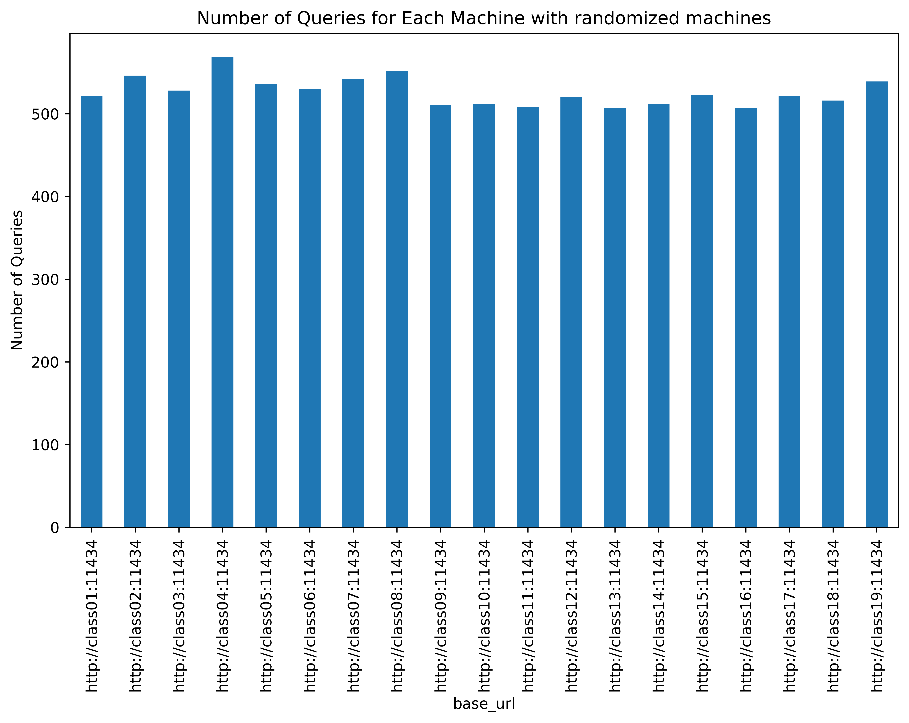
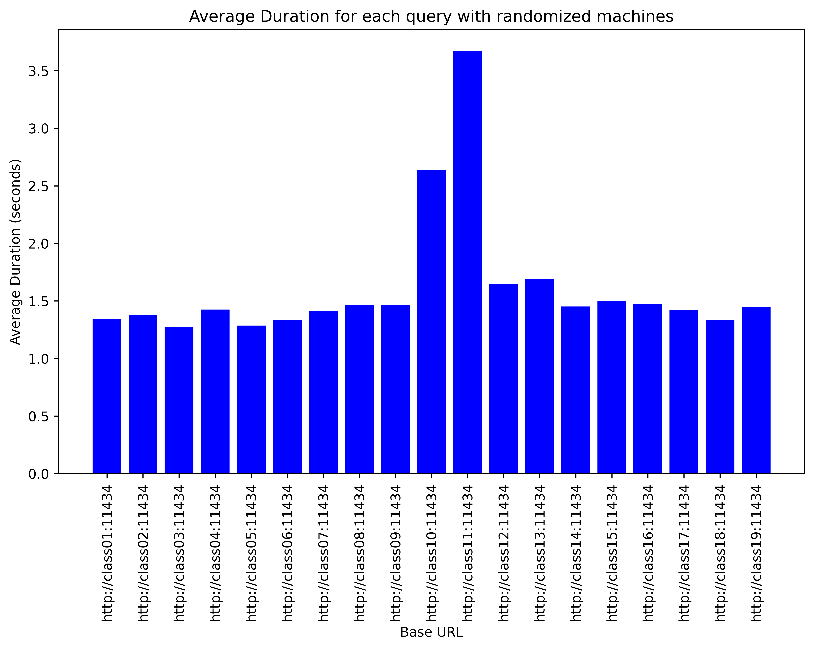
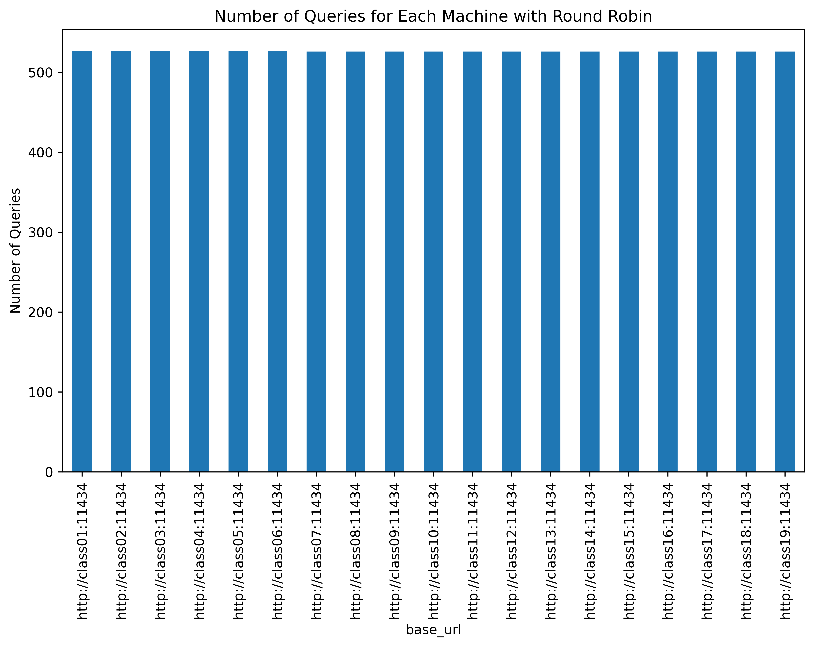
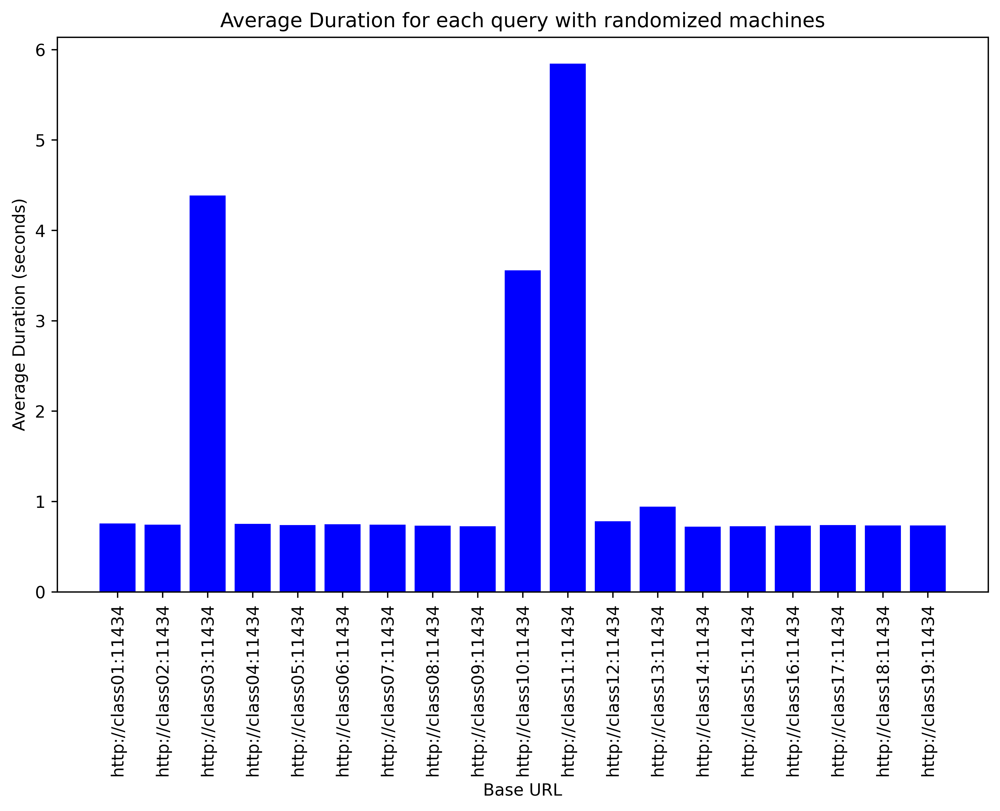

# Benchmark_dynamic.py

For code please check the [benchmark_dynamic.py](./benchmark_dynamic.py) file.

For the results below I have used the **Natural Question** dataset from google which is hosted on Huggingface at [https://huggingface.co/datasets/google-research-datasets/natural_questions](https://huggingface.co/datasets/google-research-datasets/natural_questions)

I have selected the first 10000 queries from train split of this dataset. 

## Randomized Machine Selection
When randomly choosing the machine for processing the query as follows:

```python 
for q in queries:
    llm = llms[random.choice(MACHINES)]
    ts.add_task(machine, query_api, llm, q)
```
> The random number generated in this example is from a uniform distribution, and will result in all the machines getting queries.


#### Total Time taken for 10,000 queries : **504.52 Sec**

---
### Number of queries processed by each machine


We can see that the number of queries processed by each machine are similar.

### Average time on each machine to process one query


Some of the machines have higher average time per query, this might be due there are other tasks using GPU on those machines since classroom machines are shared.

## Round Robin

This algorithm is implemented as follows 

```python 
for i, q in enumerate(queries):
    llm = llms[MACHINES[i % len(MACHINES)]]
    ts.add_task(machine, query_api, llm, q)
```

Below are the results using the **Round Robin** scheduling. 

#### Total Time taken for 10,000 queries : **431.28 Sec**

> We can see that with round robin scheduling less time is required for the same amount of queries.

### Number of queries processed by each machine



### Average time on each machine to process one query

